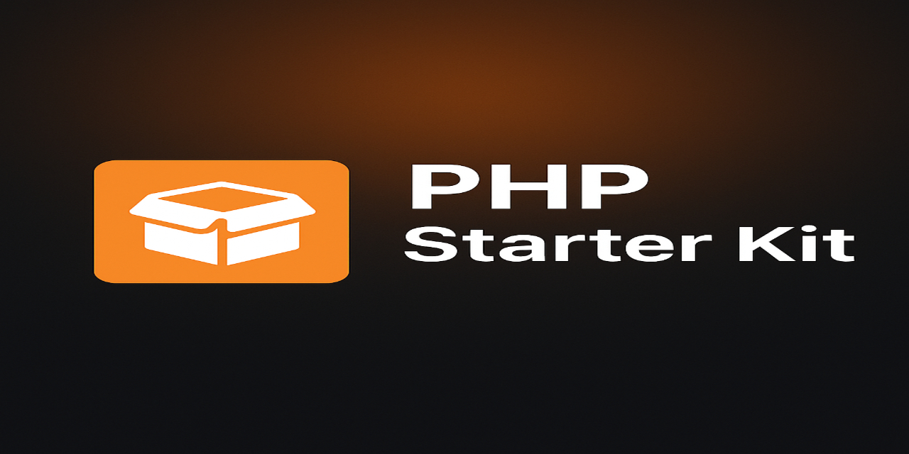

# PHP starter kit

<p align="center">
    
</p>

PHP starter kit provides a ready-to-use structure for quickly developing a new PHP package.

## Requirements

-   [PHP](https://www.php.net/) >= 8.4
-   [Composer](https://getcomposer.org/) package manager
-   [Xdebug](https://xdebug.org/) for coverage testing (only required for testing)

## Installation

```shell
composer require yourname/yourpackagename
```

## Usage

```php
<?php

// Example usage here
```

## Testing

```shell
composer test
```

## License

This project is open-sourced software licensed under the [MIT license](LICENSE).
